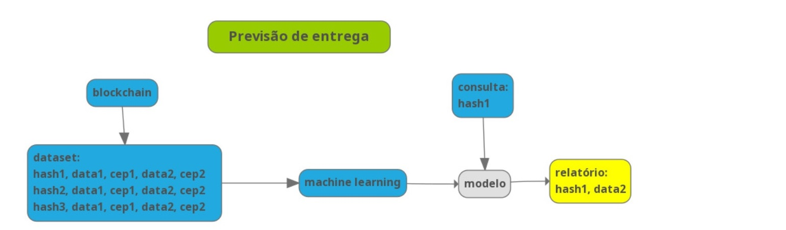

# Alysida - Previsão de entrega das mercadorias


O site de Alysida está em http://alysida.com.br/?p=6

## Os dados

Inicialmente, os dados de localização e saída, e localização e chegada, vindos do **Alysida Blockchain**, são registados num dataset. 
A partir de um determinado número de registro, esse dataset é submetido a um algoritmo de machine learning para que aprenda a prever a data de chegada das próximas remessas.



## O programa

Executar inicialmente a instalação dos programas

```
pip install -r requirements.txt

```
Serão instalados os programas

- streamlit
- protobuf
- datetime
- yfinance
- numpy
- pystan==2.19.1.1
- plotly
- matplotlib
- fbprophet==0.5
- holidays==0.9.12
- pandas

<p align="center">
  
</p>
